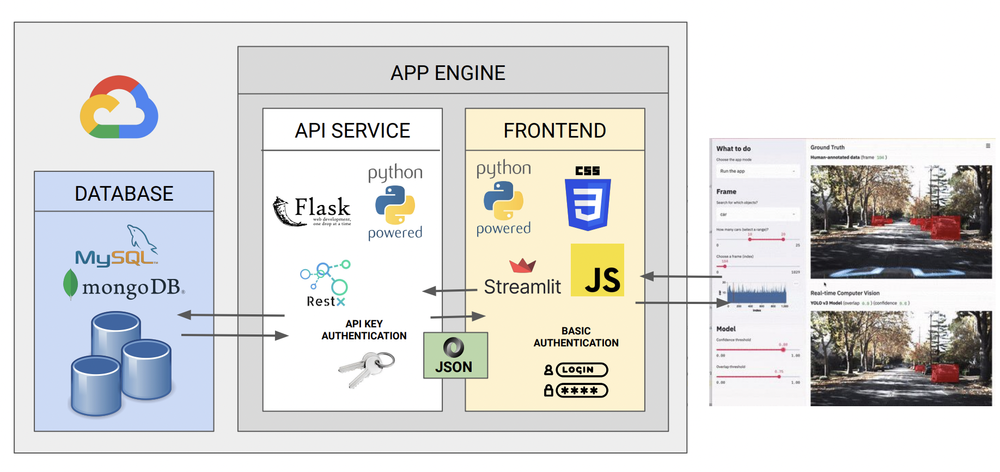

# Final Capstone project

This repository hosts all the documents utilized to build and deploy a web application displaying data from H&M****

**Important to note, I already created two users with which you can login:**

1) username: jsmith     password: abc

2) username: rbriggs     password: def

**The API will be available at:**

[The famous REST API with FLASK!](https://api-dot-directed-racer-376415.oa.r.appspot.com/)

**The Frontend will be available at:**

[Streamlit](https://frontend-dot-directed-racer-376415.oa.r.appspot.com/)

The structure of this repo is as follows:

- API
    - Contains the API created using flask_restx
    - It connects to a MySQL database and retrieves the data necessary for the client
- Client
    - Created with Streamlit
    - Enables data visualization and analysis
- Data
    - The data uploaded to MySQL they are not used by the API or Client, they have documentation purposes.

## Assigment Requirements

1. Understanding of the Data Set:
    - Generate valuable KPIs based on the provided datasets or your own datasets.
2. Database Solution:
    - Deploy a MongoDB database . At a minimum, all datasets should be stored as tables. You may also include processed tables for easier data management.
3. Back-end Integration:
    - Deploy a Flask service in Google App Engine that exposes an API to query data from the database in JSON format via HTTP GET requests. The API should require an API key for authentication.
4. Front-end Development:
    - Deploy a Streamlit service in Google App Engine or create your own charts using JavaScript, CSS, and HTML. The front-end should include filters to query data from the API and display the results in JSON format. User password authentication should be implemented.
5. Documentation, Structure of the Coding, and Presentation:
    - Use Swagger for API documentation, GitHub for version control, and create a presentation for the project.
6. Solidness of the Solution and Creativity/Going Beyond:
    - Evaluate the robustness of the solution and the level of creativity involved.

## Architecture

For the database I use MySQL but you could use MongoDB too.

For the frontend I use Streamlit but you can also create the frontend using JS and CSS.



## Deploy on Google App Engine

To deploy on google app engine it's necessary to create app.yalm files with the settings and environmental variables

1. In the **api** folder create a file called app.yaml with the following:
    
    ```
    runtime: python
    service: api
    env: flex
    
    runtime_config:
      python_version: 3
    
    entrypoint: gunicorn -b :$PORT main:app
    
    manual_scaling:
      instances: 1
    
    resources:
      cpu: 1
      memory_gb: 0.5
      disk_size_gb: 10
    ```
    
2. In the **client** folder create a file called app.yaml with the following:
    
    ```
    runtime: python
    service: frontend 
    env: flex
    
    runtime_config:
      python_version: 3
    
    entrypoint: streamlit run main.py --server.port $PORT
    
    automatic_scaling:
      max_num_instances: 1
    ```
    
3. In the **client** folder create a file called config.yaml that contains custom configuration with the following:

```
credentials:
  usernames:
    jsmith:
      email: jsmith@gmail.com
      name: John Smith
      password: $2b$12$hN4np.lVA62ZXuBSUPDRee/dqCZ/QD9IGCgPAbIPHmvGMNAqmoYJ.  #password:abc
    rbriggs:
      email: rbriggs@gmail.com
      name: Rebecca Briggs
      password: $2b$12$tHSPkuUe9Ab0H7dTlcmjauaXaYZ/3RSg0HBJ24v7vd6SVeDD49cDW  #password:def
cookie:
  expiry_days: 30
  key: random_signature_key # Must be a string
  name: random_cookie_name
preauthorized:
  emails:
  - melsby@gmail.com
```